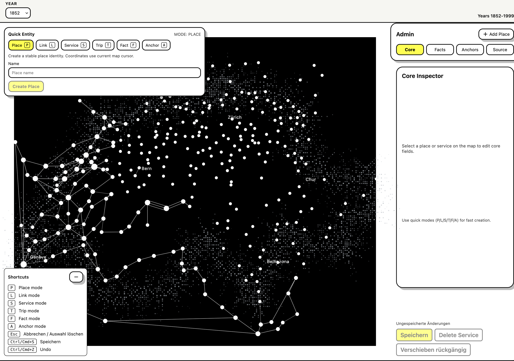
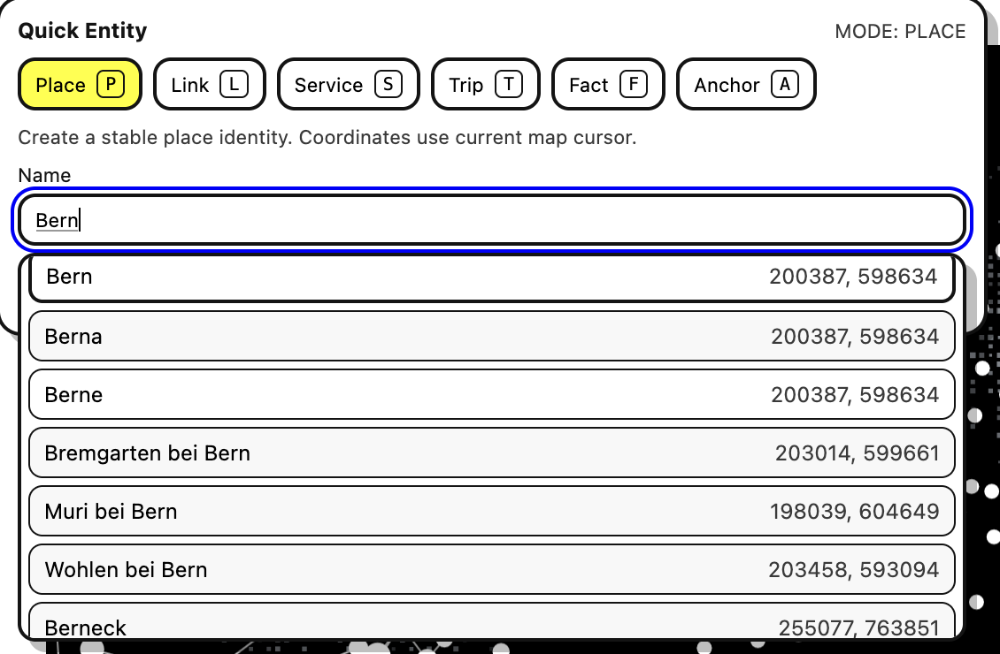

# Admin-Benutzerhandbuch

Dieses Handbuch beschreibt die tägliche Arbeit in der Admin-Seite:

1. Entitäten über **Quick Entry (Quick Entity)** erfassen
2. **Archive Snippets** (Ausschnitt aus Originalkarte) anpassen
3. Neue **Kurskarten/Jahre** hinzufügen

## 1. Überblick: Was wird im Admin bearbeitet?

Im Admin arbeitest du auf einem **einheitlichen Kartenlayout** (vereinfachte Schweiz-Karte).
Die Daten sind zeitlich über `validFrom` / `validTo` gesteuert.

- **Place**: stabiler Ort (Identität)
- **Link**: Verbindung zwischen zwei Orten (strukturell)
- **Service**: gerichtete Variante eines Links (von -> nach)
- **Trip**: einzelne Fahrzeit-Zeile eines Service
- **Fact**: Metadaten/Fakten (z. B. Wikidata, Archivhinweise)
- **Anchor**: Kartenposition eines Place (gültig für Zeiträume)




## 2. Quick Entry Workflow (empfohlene Reihenfolge)

Empfohlene Reihenfolge bei neuen Daten:

1. **Place** anlegen
2. **Link** zwischen Places anlegen
3. **Service** (Richtung + Notizen + Trips) anlegen
4. Optional **Trip**-Tabellen schnell ergänzen
5. Optional **Fact** ergänzen
6. Optional **Anchor** (Koordinate) feinjustieren

### 2.1 Quick Mode: Place

1. Quick Mode auf **Place** stellen (`P`).
2. Namen eingeben.
3. Optional GeoAdmin-Vorschlag auswählen (Pfeiltasten + Enter).
4. **Create Place** klicken.

Hinweis:
- Wenn GeoAdmin gewählt wurde, wird dessen gemappte Position verwendet.
- Sonst wird die aktuelle Karten-Cursorposition verwendet.




### 2.2 Quick Mode: Link

1. Quick Mode auf **Link** stellen (`L`).
2. `Von` und `Nach` auswählen.
3. Optional `Leuge` setzen.
4. **Create Link Draft** klicken.

Ergebnis:
- Es wird ein Link-Entwurf vorbereitet, danach direkt mit **Service** weiterarbeiten.


### 2.3 Quick Mode: Service

1. Quick Mode auf **Service** stellen (`S`).
2. `Von`/`Nach` prüfen, optional Notiz DE/FR ergänzen.
3. Trips erfassen (Transport, Dep, Arr).
4. **Create Service** klicken.


### 2.4 Quick Mode: Trip

1. Quick Mode auf **Trip** stellen (`T`).
2. Mehrere Zeilen erfassen oder einfügen.
3. **Append to Service** nutzen, um Trips an den gewählten Service anzuhängen.


### 2.5 Quick Mode: Fact

1. Quick Mode auf **Fact** stellen (`F`).
2. Ziel-Place wählen (über Auswahl/aktuellen Kontext).
3. `schemaKey`, `valueType`, `value`, `status`, `confidence` setzen.
4. Fact hinzufügen.

Beispiel:
- `schemaKey = place.wikidata_qid`
- `valueType = string`
- `value = Q11943`


### 2.6 Quick Mode: Anchor

1. Quick Mode auf **Anchor** stellen (`A`).
2. X/Y-Koordinate setzen oder aus Kartenkontext übernehmen.
3. Gültigkeit (`validFrom`, `validTo`) beachten.


## 3. Archive Snippets anpassen

Archive Snippets werden im rechten Inspector unter **Anchors** gepflegt.

### Ablauf

1. Place auf der Karte auswählen.
2. Rechts Tab **Anchors** öffnen.
3. Im Snippet-Viewer Position/Zoom so einstellen, dass der gewünschte Kartenausschnitt passt.
4. Änderungen werden für bestehende Places direkt gespeichert (Toast-Bestätigung beachten).

Wichtig:
- Der Snippet-Ausschnitt gehört zum Place (IIIF-Zentrum), nicht zum Trip.
- Für zeitliche Unterschiede nutzt du weiterhin `validFrom` / `validTo` bei den zugehörigen Daten.


## 4. Neue Kurskarte (neues Jahr) hinzufügen

Aktuell erfolgt das Hinzufügen eines neuen Jahres **über die JSON-Daten**.

### 4.1 Minimal: Jahr im Admin auswählbar machen

Datei:
- `apps/ptt-kurskarten.api/data/v2/editions.json`

Beispiel-Eintrag:

```json
{
  "id": "edition-1865",
  "year": 1865,
  "title": "Kurskarte 1865",
  "sourceId": "source-legacy-graph-json"
}
```

Danach erscheint das Jahr in der Jahresauswahl (weil die API `editions` in `/years` berücksichtigt).

Hinweis zu `sourceId`:
- `sourceId` verweist auf einen Eintrag in `apps/ptt-kurskarten.api/data/v2/sources.json`.
- Wenn die Quelle dort noch nicht existiert, zuerst in `sources.json` ergänzen.


### 4.2 Inhalt für das neue Jahr bereitstellen

Damit das Jahr nicht leer ist, müssen Entitäten für dieses Jahr aktiv sein:

- Places: `validFrom` / `validTo`
- Anchors: `validFrom` / `validTo`
- Services + Trips: `validFrom` / `validTo`
- Facts (falls zeitabhängig): `validFrom` / `validTo`

Praktischer Weg:

1. Jahr in `editions.json` eintragen.
2. Im Admin auf dieses Jahr wechseln.
3. Bestehende Daten übernehmen/anpassen (Gültigkeiten setzen).
4. Fehlende Places/Services per Quick Entry ergänzen.
5. Snippets in **Anchors** prüfen.


## 5. Speichern, Sichtbarkeit, Sicherheit

- Änderungen sind nach Speichern/Erstellen direkt wirksam (kein Draft/Main-Workflow).
- Regelmässig speichern und kleine, nachvollziehbare Änderungen machen.
- Vor grösseren Umbauten: Backup/Commit erstellen.

## 6. Tastatur-Shortcuts (wichtig für schnelle Erfassung)

- `P`: Place
- `L`: Link
- `S`: Service
- `T`: Trip
- `F`: Fact
- `A`: Anchor
- `Cmd/Ctrl + S`: Speichern
- `Cmd/Ctrl + Z`: Undo (Verschiebungen)
- `Esc`: Auswahl/Pending-Aktion abbrechen


## 7. Schnell-Checkliste pro neuer Verbindung

1. Place vorhanden?
2. Link vorhanden?
3. Service-Richtung korrekt?
4. Trips vollständig und Zeitformat korrekt?
5. Fact/Quelle nötig?
6. Anchor/Snippet visuell geprüft?
7. Gültigkeiten (`validFrom`/`validTo`) korrekt für Zieljahr?
