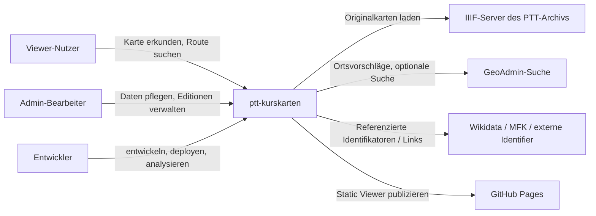
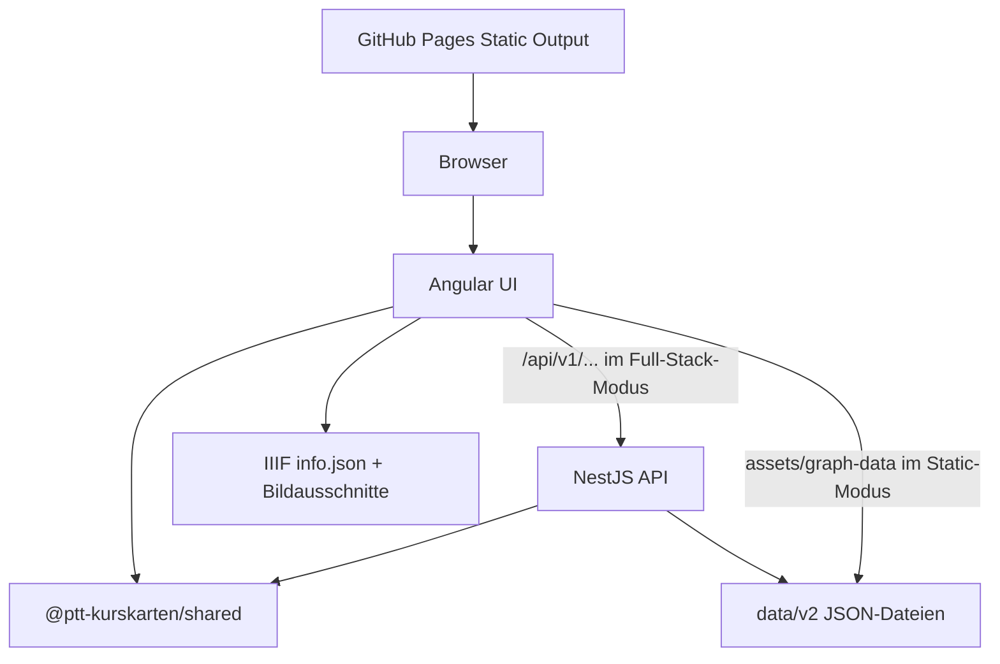
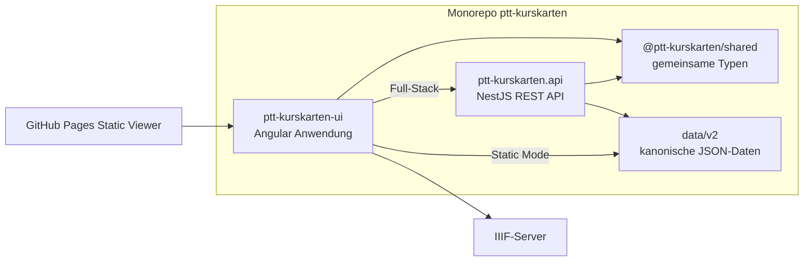
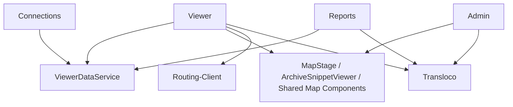
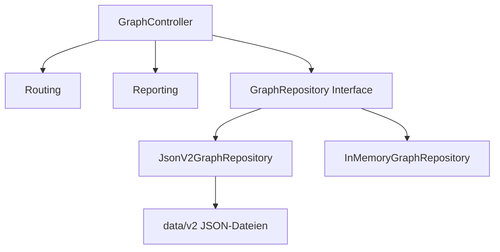
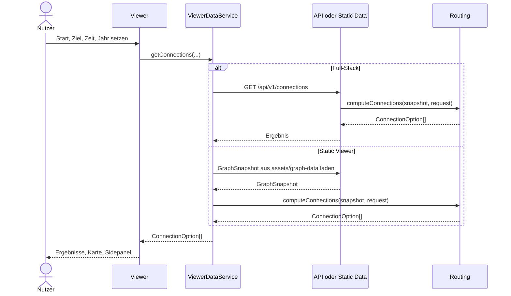
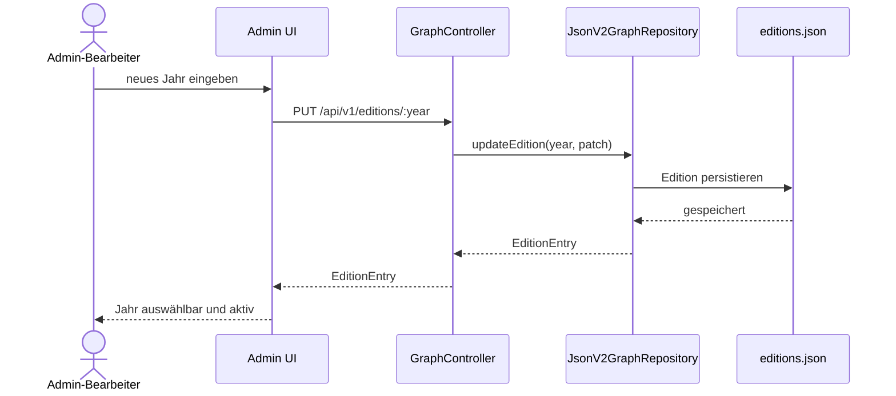
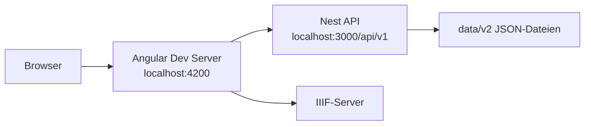
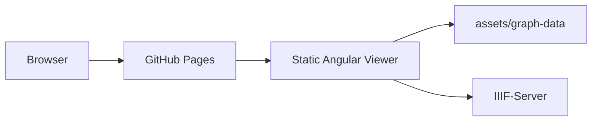
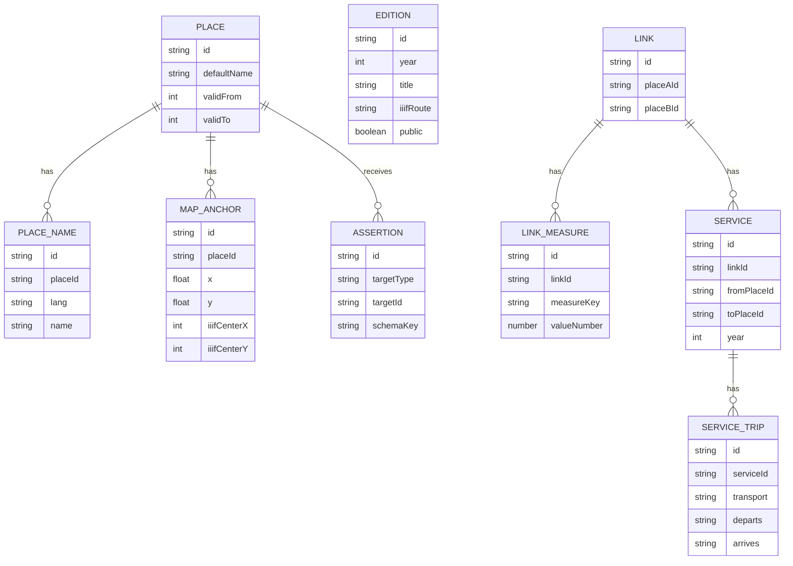

# Arc42-Dokumentation: `ptt-kurskarten`

Stand: abgeleitet aus Repository-Zustand vom 2026-03-13

Diese Dokumentation beschreibt den aktuell implementierten Stand des Systems `ptt-kurskarten`. Sie basiert auf dem Arc42-Template in deutscher Sprache, vorhandenen Projektdokumenten und dem tatsächlich vorliegenden Code. Zukunftsthemen wie eine relationale Persistenz oder ein weiterer Ausbau des Archiv-Workflows werden nur als Ausblick, Risiko oder technische Schuld beschrieben.

Die Dokumentation arbeitet bewusst mit rollenbasierten Stakeholdern und vermeidet erfundene Organisationsdetails. Wo Informationen nicht direkt aus dem Projektkontext ableitbar sind, werden Annahmen explizit kenntlich gemacht.

## 1. Einführung und Ziele

### 1.1 Aufgabenstellung

`ptt-kurskarten` ist eine interaktive Plattform zur Exploration, Pflege und Auswertung historischer Schweizer Kurskarten. Das System kombiniert eine vereinfachte, gerenderte Netzkarte mit einer Originalkartenansicht auf Basis von IIIF und stellt darauf mehrere fachliche Funktionen bereit:

- historische Kurskarten für ein gewähltes Jahr erkunden
- Orte auf Karte und Originalkarte suchen und vergleichen
- Routen zwischen zwei Orten für eine Abfahrtszeit berechnen
- Editionen und zugehörige IIIF-Quellen wechseln
- Stations- und Kantenberichte erzeugen und exportieren
- Daten über einen Admin-Workflow pflegen, inklusive Editionen, Orten, Anchors, Verbindungen, Fahrten und Fakten
- eine separate Connections-Oberfläche als alternative Routing-Sicht bereitstellen
- einen Admin-Tutorial-/Demo-Modus für geführte Einführung und demonstrationsartige Nutzung bereitstellen
- einen schreibgeschützten öffentlichen Static Viewer ohne Backend betreiben

Die Architektur dient damit zwei Nutzungsmodi gleichzeitig:

- einem voll funktionsfähigen lokalen oder internen Bearbeitungsmodus mit Angular-UI und NestJS-API
- einem öffentlichen, statischen Viewer-Modus auf GitHub Pages mit eingebetteten JSON-Daten

Wesentliche Use Cases, die aus Code und vorhandener Dokumentation ableitbar sind:

1. Historische Karte eines Jahres öffnen und visuell erkunden
2. Orte suchen und zwischen gerenderter Karte und Originalkarte navigieren
3. Route für Jahr, Start, Ziel und Abfahrtszeit berechnen
4. Edition wechseln und damit Graph- und IIIF-Kontext umschalten
5. Stationen und Kanten als Reports analysieren und CSV exportieren
6. Neue Edition anlegen und IIIF-Route pro Jahr setzen
7. Places, Anchors, Links, Services, Trips und Facts pflegen
8. Public Static Viewer ohne Schreibfunktionen bereitstellen
9. Alternative Routing-Nutzung über `/connections`
10. Geführte Admin-Nutzung über Tutorial-/Demo-Modus

### 1.2 Qualitätsziele

| Priorität | Qualitätsziel                               | Erläuterung                                                                                                                                              |
| --------- | ------------------------------------------- | -------------------------------------------------------------------------------------------------------------------------------------------------------- |
| 1         | Nachvollziehbarkeit historischer Daten      | Jahresabhängige Sicht, Editionslogik, valide Trennung von Place, Anchor, Link, Service, Trip und Assertion müssen fachlich erklärbar bleiben.            |
| 2         | Änderbarkeit des Daten- und Feature-Modells | Das System soll neue Jahre, zusätzliche Fakten, weitere Anchors und alternative Persistenzpfade ohne grundlegende UI/API-Neuschreibung aufnehmen können. |
| 3         | Nutzbarkeit für Fachanwender                | Viewer und Admin sollen für Archiv- und Redaktionsarbeit verständlich sein; Such-, Auswahl- und Bearbeitungsabläufe müssen klar bleiben.                 |
| 4         | Betriebsfähigkeit in zwei Modi              | Das System muss sowohl als Full-Stack-Anwendung mit API als auch als öffentlicher Static Viewer auf GitHub Pages funktionieren.                          |
| 5         | Technische Konsistenz zwischen UI und API   | Gemeinsame Typen und klare Schnittstellen sollen Inkonsistenzen zwischen Angular, NestJS und den JSON-Daten reduzieren.                                  |

### 1.3 Stakeholder

| Rolle                            | Kontakt       | Erwartungshaltung                                                                               |
| -------------------------------- | ------------- | ----------------------------------------------------------------------------------------------- |
| Viewer-Nutzer                    | rollenbasiert | historische Karten erkunden, Orte suchen, Routen nachvollziehen, Originalkarte einsehen         |
| Admin-Bearbeiter / Fachredaktion | rollenbasiert | neue Editionen, Orte, Verbindungen, Fahrten und Fakten effizient pflegen                        |
| Projektteam / Entwickler         | rollenbasiert | verständliche Trennung von UI, API, Datenmodell und Static-Build                                |
| Projektverantwortliche           | rollenbasiert | nachvollziehbare Architektur, überschaubare technische Schulden, öffentlich betreibbarer Viewer |
| Externe Daten-/Archivquellen     | systemisch    | stabile IIIF-Einbindung und konsistente Verwendung externer Identifikatoren                     |

## 2. Randbedingungen

| Kategorie       | Randbedingung                                                                       | Bedeutung                                                                           |
| --------------- | ----------------------------------------------------------------------------------- | ----------------------------------------------------------------------------------- |
| Technisch       | Monorepo mit `apps/ptt-kurskarten-ui`, `apps/ptt-kurskarten.api`, `packages/shared` | Architektur und Doku müssen UI, API und gemeinsame Typen zusammen betrachten.       |
| Technisch       | Angular 21 im UI-Teil                                                               | Client-seitige und statische Nutzung stehen im Vordergrund.                         |
| Technisch       | NestJS 11 im API-Teil                                                               | REST-Schnittstellen und modulare Repository-Anbindung prägen die Serverarchitektur. |
| Technisch       | Kanonisches JSON-Modell `data/v2`                                                   | JSON-Dateien sind heute Source of Truth der fachlichen Daten.                       |
| Technisch       | IIIF/OpenSeadragon                                                                  | Originalkartenansicht hängt von externen IIIF-Ressourcen und Bildmetadaten ab.      |
| Technisch       | DE/FR-Mehrsprachigkeit via Transloco                                                | UI-Texte und Benutzbarkeit müssen zweisprachig gedacht werden.                      |
| Betrieb         | Static Viewer auf GitHub Pages                                                      | Öffentliche Sicht ist bewusst eingeschränkt und arbeitet ohne Admin/API.            |
| Betrieb         | Node.js 22 in Workflows                                                             | Build- und Deploy-Pfade orientieren sich an Node 22.                                |
| Dokumentation   | Markdown mit Mermaid                                                                | Diagramme werden inline und textuell versioniert gepflegt.                          |
| Organisatorisch | Rollen statt realer Namen in dieser Doku                                            | Nicht im Repo belegbare Personen- und Organisationsdetails werden nicht erfunden.   |

## 3. Kontextabgrenzung

### 3.1 Fachlicher Kontext

Das System steht zwischen öffentlichen Nutzern, fachlichen Bearbeitern und mehreren technischen bzw. datenbezogenen Nachbarsystemen.

Fachliche Kommunikationsbeziehungen:

- Viewer-Nutzer konsumieren Such-, Routing- und Kartenfunktionen.
- Admin-Bearbeiter pflegen Jahre, Orte, Verbindungen, Trips, Facts und Anchors.
- Entwickler arbeiten an Monorepo, JSON-Daten, Builds und Deployment.
- IIIF-Quellen liefern die Originalkarten und `info.json`-Metadaten.
- GeoAdmin wird im Admin als optionale Such-/Positionierungshilfe verwendet.
- Wikidata/MFK werden nicht als Primärdatenquellen, sondern als verlinkte Referenzen bzw. Facts genutzt.
- GitHub Pages veröffentlicht ausschließlich den statischen Viewer.

### 3.2 Technischer Kontext

Technische Kanäle:

- Browser <-> Angular UI
- Angular UI <-> NestJS API über REST (`/api/v1/...`) im Full-Stack-Modus
- Angular UI <-> statische JSON-Dateien (`assets/graph-data`) im Static-Modus
- NestJS API <-> `data/v2/*.json` als Persistenz
- Angular UI <-> IIIF-Endpunkte für Originalkarten
- GitHub Actions <-> GitHub Pages für statischen Deploy

## 4. Lösungsstrategie

Die Architektur folgt einigen klaren Grundentscheidungen:

- **Klare Systemtrennung:** UI, API und Shared Types sind getrennte Bausteine mit klaren Verantwortlichkeiten.
- **Jahresbezogener Graph:** Der Viewer arbeitet auf `GraphSnapshot`-Sichten für genau ein Jahr.
- **Kanonische Datenhaltung:** `data/v2` trennt stabile Identitäten und zeitabhängige Sichten in mehreren JSON-Dateien.
- **Betrieb in zwei Modi:** Full Stack mit API für Bearbeitung und Reports; Static Viewer für öffentliche Nutzung ohne Schreibzugriff.
- **Originalkarte als Zusatzsicht:** Die IIIF-/OpenSeadragon-Integration ergänzt die gerenderte Karte, ersetzt sie aber nicht.
- **Gemeinsame Typen:** `@ptt-kurskarten/shared` minimiert Brüche zwischen Angular und NestJS.

Strategisch adressiert das System damit zwei gegensätzliche Anforderungen gleichzeitig:

- fachlich reichhaltige, bearbeitbare Archiv- und Routingfunktionen
- einfache, sichere öffentliche Veröffentlichung ohne produktive API

## 5. Bausteinsicht

### 5.1 Ebene 1: Gesamtsystem

`ptt-kurskarten` ist ein monolithisch versioniertes, aber logisch in UI, API, gemeinsame Typen und Datenhaltung gegliedertes System.

### 5.2 Ebene 2: Container

Container-Verantwortlichkeiten:

- **Angular UI:** Viewer, Admin, Reports, Connections, IIIF-Integration, Sprachumschaltung
- **NestJS API:** Graph-Snapshots, Editions, Assertions, Reports, Routing, CRUD
- **Shared Package:** Domain-Typen wie `GraphNode`, `GraphEdge`, `EditionEntry`, `ConnectionOption`
- **`data/v2`:** kanonische Datenhaltung für Places, Anchors, Editions, Links, Services, Trips und Assertions
- **IIIF-Server:** Originalkartenbilder und Metadaten

### 5.3 Ebene 3: Wichtige UI-Bausteine

Wesentliche UI- und UI-nahe Unterstützungsbausteine:

- **Viewer:** zentrale öffentliche Oberfläche mit Karte, Route Planner, Archivmodus, Editionen und Simulation
- **Admin:** Bearbeitungsoberfläche für Editionen, Anchors, Places, Links, Services, Trips und Facts
- **Admin-Tutorial/Demo:** geführte bzw. demonstrative Admin-Nutzung über separate Route und Demo-Repository
- **Reports:** Stations- und Kantenberichte mit CSV-Export
- **Connections:** alternative, direkte Routing-Oberfläche
- **ViewerDataService:** Kapselung zwischen API-Modus und statischem JSON-Modus
- **Routing-Client:** UI-seitige Kapselung der Routing-Aufrufe und der dazugehörigen Request-/Response-Verwendung
- **Shared Map/Archive Components:** Karten-Rendering, Zoom/Pan, IIIF-Viewer
- **Transloco:** Querschnittsbaustein für Sprachumschaltung, Übersetzungsschlüssel und DE/FR-Textausgabe in der UI

Der Abschnitt enthält damit bewusst nicht nur sichtbare Screens, sondern auch zentrale technische UI-Bausteine, ohne die Viewer, Admin, Reports und Connections nicht funktionsfähig wären.

### 5.4 Ebene 3: Wichtige API- und Datenzugriffsbausteine

Wesentliche API-Bausteine:

- **GraphController:** REST-Endpunkte für Graph, Years, Editions, Assertions, Routing, Reports und CRUD
- **Routing:** Berechnung von `ConnectionOption` aus jahresbezogenen Graphdaten
- **Reporting:** Station Profile und Edge Timetable Reports
- **GraphRepository:** abstrakte Schnittstelle für Datenzugriff
- **JsonV2GraphRepository:** Standard-Repository, das `data/v2` liest und schreibt
- **InMemoryGraphRepository:** einfacher Alternativpfad für Demo/Test

## 6. Laufzeitsicht

### 6.1 Route im Viewer suchen

### 6.2 Originalkarte und Edition wechseln

Ablauf:

1. Nutzer wechselt Edition im Viewer.
2. Die `year`-Sicht wird umgeschaltet.
3. UI lädt passende Graphdaten und die zugehörige `iiifRoute`.
4. Die Originalkartenansicht öffnet die entsprechende IIIF-Quelle.
5. Bei Ortsfokus wird der Snippet-/Archivbereich auf den passenden Anchor gesetzt.

### 6.3 Neue Edition im Admin anlegen und IIIF-Route setzen

### 6.4 Place/Link/Service/Trip/Fact bearbeiten

Typischer Ablauf im Admin:

1. Jahr bzw. Edition wählen
2. Place neu anlegen oder vorhandenen Place wiederverwenden / einblenden
3. Anchor und Archive Snippet pro Jahr prüfen oder korrigieren
4. Link vorbereiten
5. Service für genau ein Jahr anlegen
6. Trips an Service anhängen
7. Facts/Assertions pflegen
8. Ergebnis im Graph und optional im Viewer kontrollieren

### 6.5 Static Viewer ohne API

Im Static Build verwendet das UI keine Live-API-Aufrufe. Stattdessen werden normalisierte JSON-Dateien in das Deploy-Artefakt kopiert und vom Viewer direkt aus `assets/graph-data` gelesen. Admin, Reports und Connections sind in diesem Deploy explizit nicht enthalten.

## 7. Verteilungssicht

### 7.1 Lokale Entwicklung

Lokaler Full-Stack-Betrieb:

- Angular UI läuft separat
- NestJS API läuft separat
- API nutzt standardmässig das JSON-v2-Repository
- Änderungen landen direkt in `apps/ptt-kurskarten.api/data/v2/*.json`

### 7.2 Öffentlicher Static Viewer

Abgrenzung des öffentlichen Deploys:

- Viewer ist öffentlich
- Routing im Viewer bleibt verfügbar, aber rein client-seitig auf statischen Daten
- Admin, Reports und Connections sind nicht Bestandteil des GitHub-Pages-Artefakts
- keine Schreiboperationen gegen eine API

## 8. Querschnittliche Konzepte

### 8.1 Jahres- und Editionslogik

- `EditionEntry` beschreibt den Jahreskontext einer Kurskarte
- Graphdaten werden als `GraphSnapshot` pro Jahr materialisiert
- Places, Anchors und Assertions nutzen `validFrom` / `validTo`
- Services und Trips sind explizit jahresgebunden
- IIIF-Routen sind editions- bzw. jahresbezogen

### 8.2 Datenmodell `v2`

Das `v2`-Modell ist normalisiert und trennt Identität, Kartenposition, Struktur, Fahrplandaten und Metadaten.

### 8.3 Mehrsprachigkeit

- UI-Texte werden über Transloco in Deutsch und Französisch verwaltet.
- Place-Namen und Fakten können historisch und sprachlich variieren.
- Mehrsprachigkeit betrifft sowohl Bedienoberfläche als auch fachliche Darstellung.

### 8.4 Archiv-/IIIF-Integration

- Originalkarten werden nicht lokal gespeichert, sondern über IIIF referenziert.
- `iiifInfoUrl` liefert Metadaten des Gesamtbildes.
- `imageUrl` bzw. Snippet-URLs referenzieren konkrete Bildausschnitte.
- Anchors enthalten optional IIIF-Zentren pro Place und Jahr.

### 8.5 Routing- und Reporting-Konzept

- Routing erfolgt auf einem jahresbezogenen Graphen
- Ergebnisobjekte bestehen aus Verbindungen und Legs
- Reports verdichten Stations- und Kanteninformationen in eigene Sichten
- Exporte werden im UI als CSV erzeugt

### 8.6 Sichtbarkeit und Hidden-Logik

- Ein Place kann für ein bestimmtes Jahr verborgen werden
- `Delete Place` im Admin bedeutet jahrbezogenes Ausblenden, nicht globale Löschung
- `Unhide & Use Place` reaktiviert im Jahr unsichtbare Places

### 8.7 Static-vs-API Datenzugriff

- `ViewerDataService` kapselt beide Datenpfade
- Full Stack: Daten aus REST-Endpunkten
- Static Mode: Daten aus `assets/graph-data`
- Die fachliche Domäne bleibt gleich, nur der Transportweg ändert sich

## 9. Architekturentscheidungen

| Entscheidung                                    | Begründung                                                                      |
| ----------------------------------------------- | ------------------------------------------------------------------------------- |
| JSON `v2` ist heute kanonisches Modell          | erleichtert Nachvollziehbarkeit, manuelle Review und schrittweise Modellreifung |
| `links` sind ungerichtet, `services` gerichtet  | trennt strukturelle Verbindung von jahres- und richtungsabhängigem Fahrplan     |
| Gemeinsame TS-Typen in `@ptt-kurskarten/shared` | reduziert Inkonsistenzen zwischen UI und API                                    |
| Static Viewer als separater Betriebsmodus       | erlaubt sichere öffentliche Veröffentlichung ohne schreibende API               |
| Mermaid für Architekturdiagramme                | textbasiert, versionierbar, ohne zusätzliche Diagrammtoolchain                  |
| IIIF als externe Originalkartenquelle           | vermeidet lokale Bildduplikation und unterstützt große Originalkarten           |

## 10. Qualitätsszenarien

### QS1: Routing für gewähltes Jahr

Wenn ein Nutzer im Viewer Start, Ziel, Jahr und Abfahrtszeit setzt, dann soll das System Verbindungen auf Basis des gewählten Jahres berechnen und verständlich darstellen.

### QS2: Neue Edition anlegen

Wenn ein Admin ein neues Jahr anlegt und eine IIIF-Route setzt, dann soll dieses Jahr ohne Schemaänderung auswählbar werden und den korrekten Kartenkontext laden.

### QS3: Static Viewer ohne API

Wenn das System auf GitHub Pages deployed wird, dann soll der Viewer ohne Live-API lauffähig bleiben und seine Daten nur aus statischen Artefakten beziehen.

### QS4: Historische Nachvollziehbarkeit

Wenn Anchors, Facts oder Places zeitlich variieren, dann soll die Datenstruktur diese Unterschiede über Jahre nachvollziehbar und ohne Duplikation der Place-Identität abbilden.

## 11. Risiken und technische Schulden

- JSON-Dateien sind aktuell Source of Truth; mit wachsender Datenmenge steigen Integritäts- und Pflegeaufwand.
- Dokumentation und Fachmodell können auseinanderlaufen, wenn die JSON-Struktur oder UI-Workflows stark evolvieren.
- Der Viewer hängt für die Originalkartenansicht von extern verfügbaren IIIF-Ressourcen ab.
- Die UX bündelt Kartenexploration, Routing, Archivsicht und Admin-Bearbeitung in einer gemeinsamen Domäne; diese Komplexität ist fachlich sinnvoll, aber gestalterisch anspruchsvoll.
- Ein PostgreSQL-Migrationspfad ist beschrieben, aber noch nicht umgesetzt.
- Der Static Viewer ist bewusst eingeschränkt; Erwartungsmanagement zwischen öffentlichem Viewer und lokaler Vollversion bleibt wichtig.

## 12. Glossar

| Begriff            | Bedeutung                                                                     |
| ------------------ | ----------------------------------------------------------------------------- |
| Place              | stabiler Ort bzw. fachliche Ortsidentität                                     |
| Anchor             | Kartenposition eines Place auf der vereinfachten Karte, ggf. mit IIIF-Zentrum |
| Edition            | jahresbezogener Kontext einer Kurskarte, inklusive Titel und IIIF-Route       |
| Link               | ungerichtete strukturelle Verbindung zwischen zwei Places                     |
| LinkMeasure        | Messwert zu einem Link, z. B. Distanz                                         |
| Service            | gerichtete, jahresgebundene Verbindung von `fromPlaceId` nach `toPlaceId`     |
| Trip / ServiceTrip | einzelne Fahrzeitzeile eines Service                                          |
| Fact / Assertion   | generische Metadaten- oder Identifier-Aussage zu einer Entität                |
| GraphSnapshot      | materialisierte Sicht des Netzes für genau ein Jahr                           |
| IIIF Route         | Basisroute zur IIIF-Ressource einer Edition                                   |
| IIIF Info URL      | `info.json`-Metadaten einer IIIF-Bildquelle                                   |
| Archive Snippet    | fokussierter Bildausschnitt der Originalkarte                                 |
| Static Viewer      | öffentlicher, schreibgeschützter Viewer ohne Backend                          |

## Quellenbasis dieser Dokumentation

Diese Arc42-Dokumentation wurde aus folgenden Quellen im Repository abgeleitet:

- `README.md`
- `apps/ptt-kurskarten.api/data/v2/README.md`
- `docs/admin-benutzerhandbuch.md`
- `docs/usability-test-one-person-trip-planning.md`
- `docs/usability-test-one-person-admin.md`
- `docs/lokal-entwicklung-und-github-deploy.md`
- `apps/ptt-kurskarten-ui/src/app/app.routes.ts`
- `apps/ptt-kurskarten-ui/src/app/app.routes.static.ts`
- `apps/ptt-kurskarten-ui/src/environments/environment.ts`
- `apps/ptt-kurskarten-ui/src/environments/environment.static.ts`
- `apps/ptt-kurskarten-ui/src/app/features/viewer/*`
- `apps/ptt-kurskarten-ui/src/app/features/admin/*`
- `apps/ptt-kurskarten-ui/src/app/features/reports/*`
- `apps/ptt-kurskarten-ui/src/app/features/connections/*`
- `apps/ptt-kurskarten.api/src/graph/graph.controller.ts`
- `apps/ptt-kurskarten.api/src/graph/graph.module.ts`
- `apps/ptt-kurskarten.api/src/graph/graph.repository.ts`

Nicht aus dem Repository belegbare Organisationsdetails wurden bewusst nicht ergänzt.
