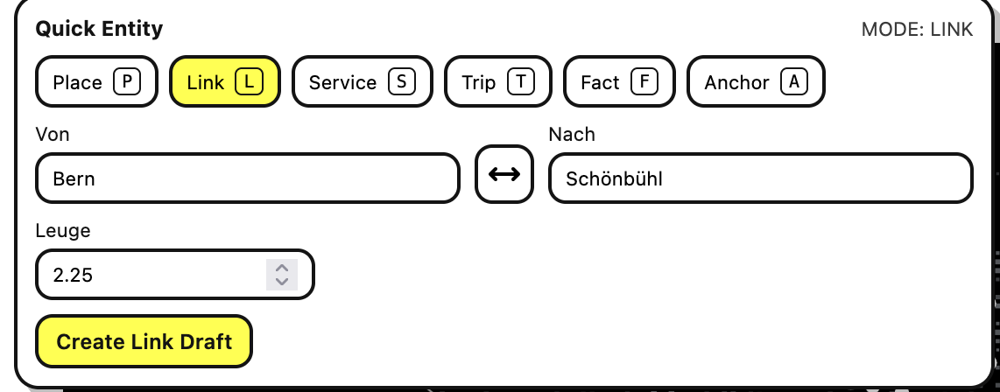
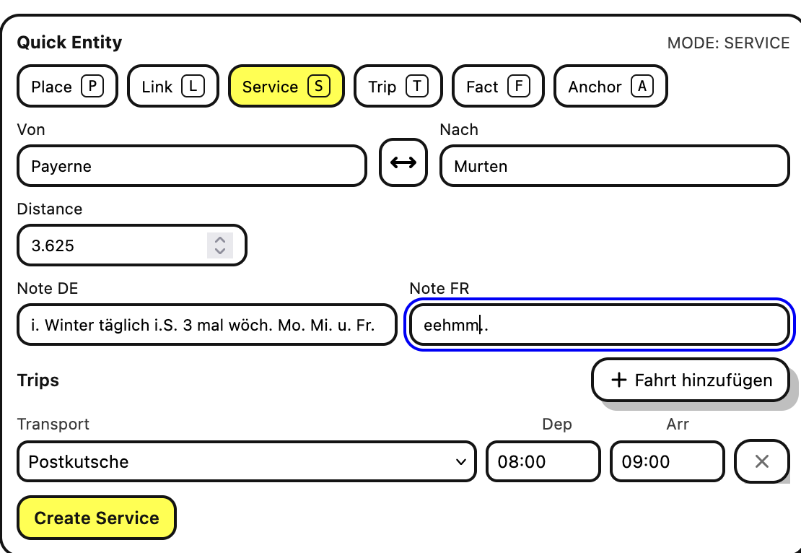
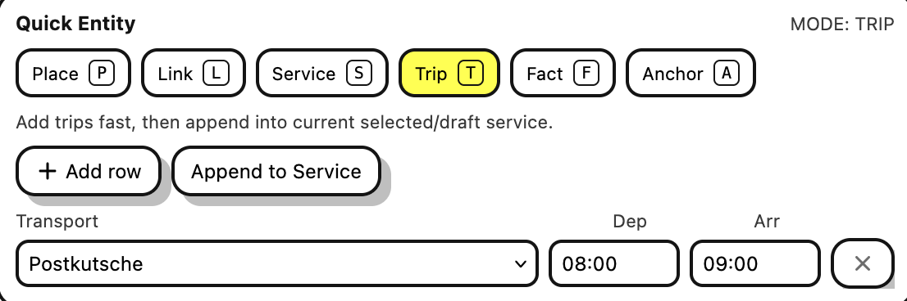
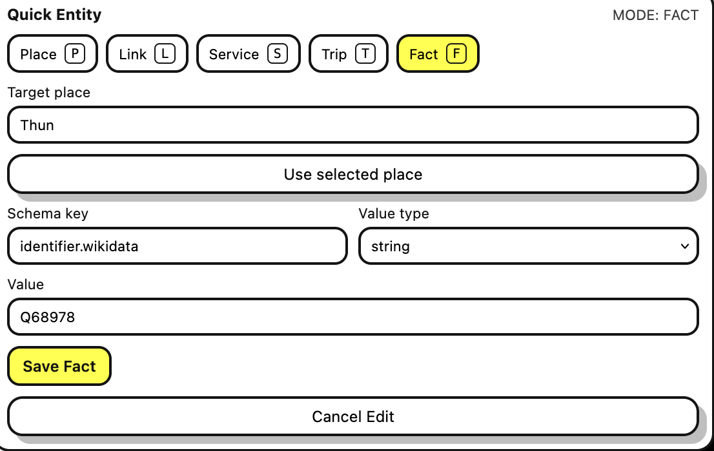
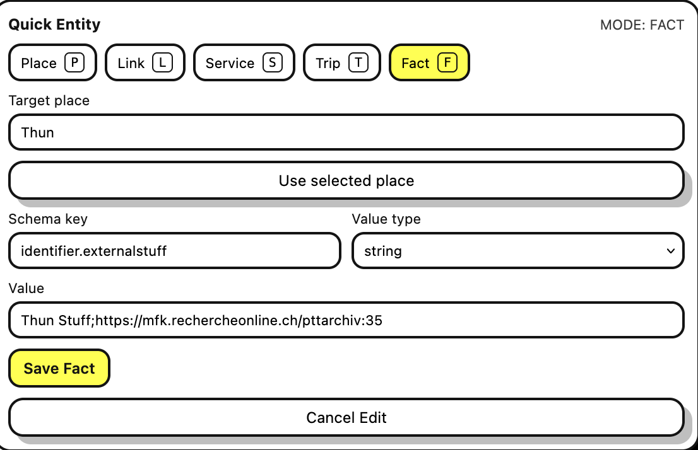
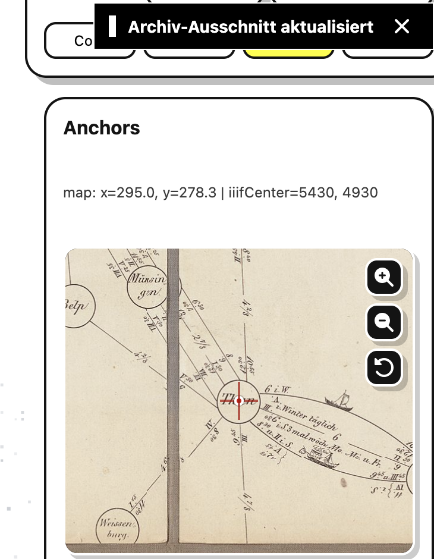

# UI Visual Reference

Dieses Dokument sammelt die wichtigsten UI-Zustaende als schnelle visuelle Referenz fuer Refactors an Viewer, Admin und Shared UI.

## Zweck

- Aenderungen an Panels, Controls, Listen und Statusdarstellungen schneller gegen bekannte Referenzen vergleichen.
- Manuelle Browser-Paesse mit einer festen Capture-Liste unterstuetzen.
- Vor einer spaeteren visuellen Regression eine einfache, repo-nahe Baseline haben.

## Vorhandene Referenzscreenshots

### Admin

- Uebersicht: 
- Quick Place: 
- Quick Link: 
- Quick Service: 
- Quick Trip: 
- Quick Fact: 
- Quick Fact Edit: 
- Archive Snippet: 

## Capture-Matrix Fuer Den Manuellen Browser-Pass

### Viewer

| Bereich       | Desktop | Mobile | Hinweise                                             |
| ------------- | ------- | ------ | ---------------------------------------------------- |
| Viewer-Shell  | offen   | offen  | Header, Floating Actions, Sidebar bzw. Mobile Sheet  |
| Planner       | offen   | offen  | Empty, Searching, Results, No Results, Time Controls |
| Place Details | offen   | offen  | Facts, ausgehende/eingehende Verbindungen, Aktionen  |
| Route Details | offen   | offen  | Hover-Zustand, Wait-Segmente, Details-on-map         |
| Archive Mode  | offen   | n/a    | Header, Archive Stage, Route Node Panel              |

### Shared UI / Admin

| Bereich           | Status    | Hinweise                                                                               |
| ----------------- | --------- | -------------------------------------------------------------------------------------- |
| Admin Panel Stack | vorhanden | Referenzen oben nutzen, bei groesseren Struktur-Aenderungen neue Screenshots ergaenzen |
| Toast             | offen     | Container, Accent, Dismiss-Button, unterschiedliche Typen                              |
| Shared Primitives | offen     | Buttons, Status-Badges, Listen, Meta-Zeilen in realen Screens                          |

## Update-Regeln

- Neue Screenshots nur fuer stabile, wiederkehrende Zustande ablegen.
- Dateinamen nach Bereich und Zustand benennen, zum Beispiel `viewer-desktop-planner-results.png`.
- Bei groesseren UI-Refactors die betroffenen Referenzen im selben PR aktualisieren.
- Wenn nur kleine Spacing- oder Typografie-Aenderungen passieren, reicht ein Verweis im Tracker statt eines neuen Screenshots.
